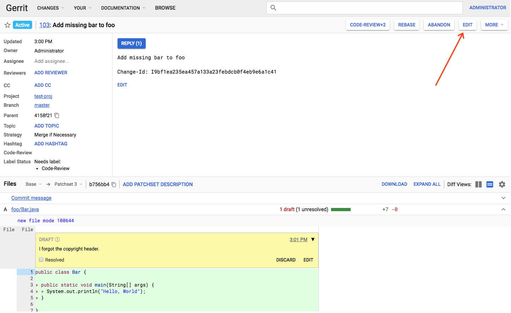
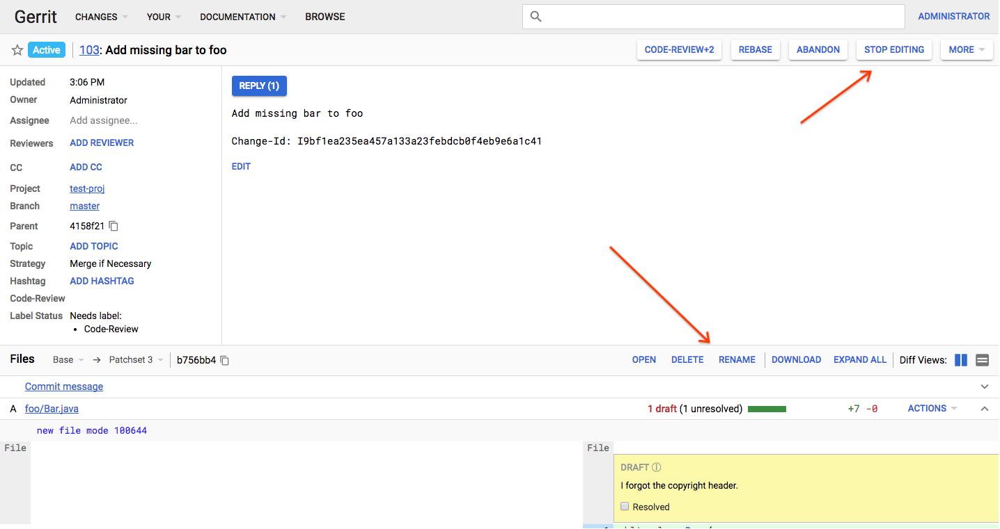
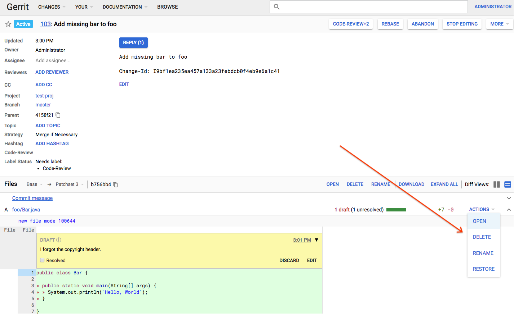
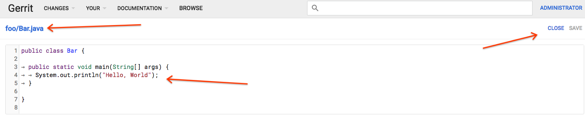
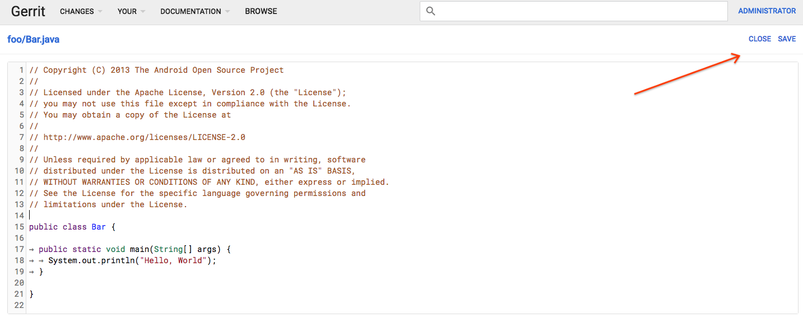
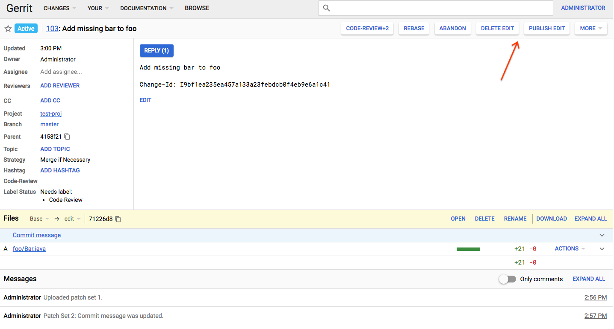

# In-browser Editing in Gerrit

### What's going on?

Until Q1 of 2018, editing a file in the browser was not supported by Gerrit's
new UI. This feature is now done and ready for use.

Read on for a walkthrough of the feature!

### Creating an edit

Click on the "Edit" button to begin.

One may also go to the project mmanagement page (Browse => Repository =>
Commands => Create Change) to create a new change.

### Performing an action

The buttons in the file list header open dialogs to perform actions on any file
in the repo.

*   Open - opens an existing or new file from the repo in an editor.
*   Delete - deletes an existing file from the repo.
*   Rename - renames an existing file in the repo.

To leave edit mode and restore the normal buttons to the file list, click "Stop
editing".

### Performing an action on a file

The "Actions" dropdown appears on each file, and is used to perform actions on
that specific file.

*   Open - opens this file in the editor.
*   Delete - deletes this file from the repo.
*   Rename - renames this file in the repo.
*   Restore - restores this file to the state it existed in at the patch the
edit was created on.

### Modifying the file

This is the editor view.

Clicking on the file path allows you to rename the file, You can edit code in
the textarea, and "Close" will discard any unsaved changes and navigate back to
the previous view.

### Saving the edit

You can save changes to the code with `cmd+s`, `ctrl+s`, or by clicking the
"Save" button.

### Publishing the edit

You may publish or delete the edit by clicking the buttons in the header.

### What if I have questions not answered here?

Gerrit's [official docs](https://gerrit-review.googlesource.com/Documentation/user-inline-edit.html)
are in the process of being updated and largely refer to the old UI, but the
user experience is largely the same.

Otherwise, please email
[the repo-discuss mailing list](mailto:repo-discuss@google.com) or file a bug
on Gerrit's official bug tracker,
[Monorail](https://bugs.chromium.org/p/gerrit/issues/entry?template=PolyGerrit+Issue).